To learn about how a complete genome looks like, we will use the following resources:

1.  **NCBI Resources**: [NCBI](https://www.ncbi.nlm.nih.gov/)
2.  **Artemis Genome Browser**: [Artemis](https://sanger-pathogens.github.io/Artemis/Artemis/)

Let's begin with the first and most powerful resource in bacterial genomics, the NCBI.

# 1. NCBI & BLAST

The **National Center for Biotechnology Information (NCBI)** is a public bioinformatics platform that provides access to biological data and tools for analyzing DNA, RNA, and protein sequences. It hosts major databases such as GenBank (nucleotide sequences), RefSeq (curated reference genomes and genes), SRA (raw sequencing data), and protein resources, making it a central resource for genomic research and education.

One of the most widely used NCBI tools is **BLAST (Basic Local Alignment Search Tool)**, which compares a query sequence against database sequences to find regions of similarity. BLAST helps identify genes, predict function, detect homologs, and assess evolutionary relationships. It works by producing local alignments and ranking results based on similarity scores and statistical significance (E-values).Different BLAST programs are used depending on the analysis type: BLASTn (DNA vs DNA), BLASTp (protein vs protein), BLASTx (translated DNA vs protein), and tBLASTn (protein vs translated DNA). These options allow flexible analysis of genomic and proteomic data.

In genomics, BLAST is commonly used for sequence identification, annotation, and comparative analysis. By finding similar sequences across organisms, it supports studies of gene function, evolutionary relationships, and phylogeny. It is often the first step in genomic analysis before more detailed alignment and tree-building methods.

## 1.1 NCBI Practice 1

### Objectives

- Use BLAST to identify unknown DNA sequences
- Interpret E-value, query coverage, and % identity
- Construct basic interpretations from sequence similarity

### Background

Your lab has identified a following DNA sequence from cerebrospinal fluid of a patient with meningoencephalitis:

``` {.default .code-overflow-wrap code-line-numbers="false"}
ACTGGTTGTATTCCCTCTAAGTGCTCTCCTTTTATTTTCTACCCACTTTTTTATGTCTCTCTTTGTCGACTCAAGAGATACAAGACGGTCATTGACACTTAAGAAACTAGTACCCAACCAGCCTTCCTTCACTGACTTTGGGGAAACTTTATCACCCACCTTGAAGGCCAAGAGAATGATGGCATCAAAAATTAATAAGAGTTTCCTTCTCGTGTTTAAAATACGCAAAGACTTGACTTTATTTAAAAAAGACCGCCAACATTGCATCTGAGTAGTACCGTGACCTTCAGAAGAATTTAGTTCTTCTTCATTTAACTCAGAGTAGAGGAACTTCAAAATTGGAGAGGACTCTTTATAACAGTTCTCAAGGGTCTCTAGGTCATCATGGCCTTCTTTAATGATGTCTTTATACATGTCACAAAACCCGTCCAATAAAACCCCTTTATCAACTTTTATAAACTGTGCTTCAATTTCACCATTCCTAAACCTATTTCTAAAAATCTGATACTCTTCCTCTATTGTCATTTTAACCTCCTGTGTTGTCATTTTGTTGTTTATACCTTGATGGCAGATAGATATAATTTCATCAAAATGATCAGCTCTTTTGTCAGACAAAGTGTTCATATTCTCAATCCCTGACAATCTACTAGTGCTCATTGAAAGGGATTCACAAAGCCTTGAATACTCAGACTCCTCAAACAATGCATTGCTCTCCTGGGCATATTTCAGGAGAGAAAAAAGAGTGTCTCTGAGTTTATCATTAACCCAGTCTGGTATTTGCTCATTGTAGAATGATACTCTCCCGTCAATCAATGGAATTAGATTGATACCAATGGATTCTAAATCCATCTTCAGCTGTTCAAGCTTTTTTGCATCTTCAAGGTACTTCTGTTCAAAATTAGCTGGTGAACTCCTAACGAAGCACTCCAGAAGAATCAATACATTTCCATTTAACTTGTAACCATCAGGCACAACAAAACAGAGGGCAGGGCTCAGTATC
```

### Tasks

1.  Go to NCBI

2.  Open BLAST

3.  Select Nucleotide BLAST

4.  Paste the provided sequence and run the search with default database and search parameters

5.  Answer the following questions:

    - **What is the most likely organism?**
    - **Which species do the other matching sequences belong to?**
    - **What is the gene?**
    - **Compare the top hits using query coverage, E-value and Percentage identity?**

6.  Select **"Distance tree of results"** to view pairwise distances of your query sequence to the matched sequences. What do you find?

## 1.2 NCBI Practice 2

### Objectives

- Use NCBI to search and download protein sequences and annotations
- Compare the protein sequences and download the Results Table

### Background

You will study the similarities of the **HA (Hemagglutinin) protein** from seasonal and avian influenza viruses. Influenza viruses are classified based on the antigenic characteristics of their surface glycoproteins—hemagglutinin (HA) and neuraminidase (NA). In Influenza A virus, 18 HA subtypes and 11 NA subtypes have been identified, and the HA subtypes are further grouped into two major evolutionary lineages: **Group 1 (including H1, H2, H5, and others)** and **Group 2 (including H3, H4, H7, and others)**, based on phylogenetic analysis of the HA gene.

Now, let's download the HA protein sequences of H1N1, H3N2, H5N1 and H7N9 from NCBI.

### Tasks

1.  Go to NCBI
2.  Select "Protein Database"
3.  Search with key words **"influenza A H1N1 hemagglutinin"**
4.  Filter to **"RefSeq"** and select a complete HA protein sequence from a representitive H1N1 strain
5.  Record the **accession number (i.e YP_009118626.1)**
6.  Download the protein sequence: **"Send to" --\> "File" --\> "Format" --\> "FASTA" --\> "Create File"**

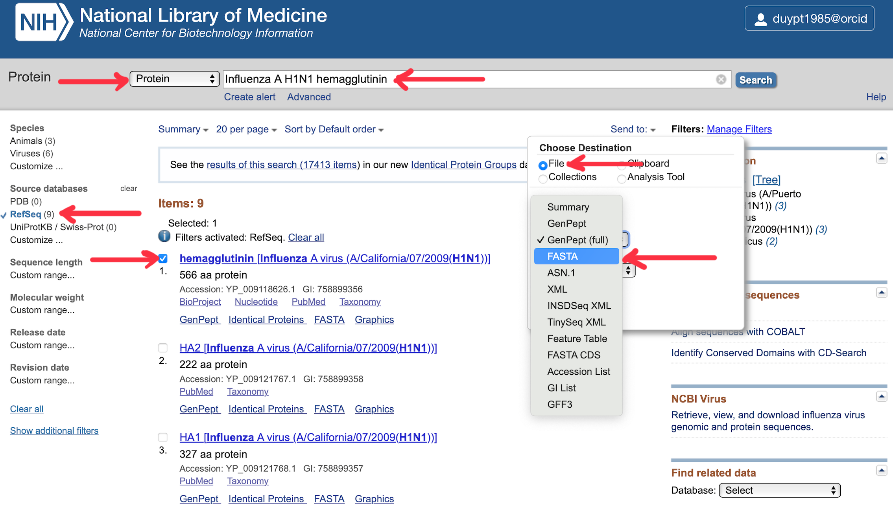

> Congratulations! 🎉 You have successfully downloaded the HA protein sequence of H1N1.

7.  Repeat step 3-6 with key words **"influenza A H3N2 hemagglutinin"**
8.  Repeat step 3-6 with key words **"influenza A H5N1 hemagglutinin"**
9.  Repeat step 3-6 with key words **"influenza A H7N9 hemagglutinin"**

> Congratulations! 🎉 You have now downloaded the HA protein sequences of H1N1, H3N2, H5N1 and H7N9.

Now, let's compare the protein sequences of H1N1, H3N2, H5N1 and H7N9 using BLAST.

10. Go to NCBI and Select **"Protein BLAST"**
11. Select **"Align two or more sequences"**
12. Compare the protein sequence of **H1 (query)** with **H3, H5, H7 sequences (subject)** by entering their assession numbers and **running "BLAST"**

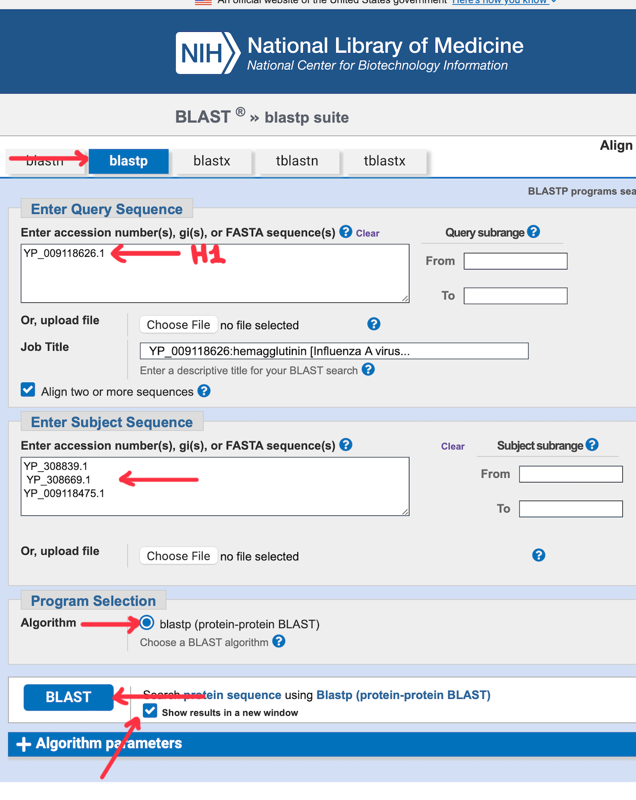

13. Answer the following questions:

    - **What is the closest sequence to H1, and what evidence supports this?**
    - **What is the most distantly related sequence to H1?**
    - **Do the results support the grouping of HA into Group 1 and Group 2?**
    - **Which sequences cluster together in the distance tree, and what does this suggest about their relationship?**

::: callout-tip
The BLAST results window contains multiple reports. Feel free to explore them. <br> You can switch between different alignment views; for example **"Pairwise" and "Pairwise with dots for identity"** to better visualize sequence similarities in NCBI BLAST. You can download or save the BLAST results!
:::

## 1.3 NCBI Practice 3

::: {.callout-note collapse="false"}
This is an independent application practice. You are expected to use the knowledge and skills gained in previous practices to complete the analysis without step-by-step instructions.
:::

### Objectives

1.  Use NCBI BLAST (Protein BLAST) to identify the influenza subtype from an HA protein sequence.

2.  Interpret sequence similarity by comparing the unknown HA sequence with reference HA sequences from H1N1, H3N2, H5N1, and H7N9 (from Practice 2).

### Background

*Your lab has identified the following HA protein sequence from unknown influenza virus*

``` {.default .code-overflow-wrap code-line-numbers="false"}
METISLITILLVVTASNADKICIGHQSTNSTETVDTLTETNVPVTHAKELLHTEHNGMLCATSLGHPLILDTCTIEGLVYGNPSCDLLLGGREWSYIVERSSAVNGTCYPGNVENLEELRTLFSSASSYQRIQIFPDTTWNVTYTGTSRACSGSFYRSMRWLTQKSGFYPVQDAQYTNNRGKSILFVWGIHHPPTYTEQTNLYIRNDTTTSVTTEDLNRTFKPVIGPRPLVNGLQGRIDYYWSVLKPGQTLRVRSNGNLIAPWYGHVLSGGSHGRILKTDLKGGNCVVQCQTEKGGLNSTLPFHNISKYAFGTCPKYVRVNSLKLAVGLRNVPARSSRGLFGAIAGFIEGGWPGLVAGWYGFQHSNDQGVGMAADRDSTQKAIDKITSKVNNIVDKMNKQYEIIDHEFSEVETRLNMINNKIDDQIQDVWAYNAELLVLLENQKTLDEHDANVNNLYNKVKRALGSNAMEDGKGCFELYHKCDDQCMETIRNGTYNRRKYREESRLERQKIEGVKLESEGTYKILTIYSTVASSLVLAMGFAAFLFWAMSNGSCRCNICI
```

### Tasks

Answer the following questions:

- **What is the best BLAST match for the unknown HA sequence, including subtype?**
- **Which reference subtypes (H1, H3, H5, H7) appear among the top BLAST hits?**
- **Based on your results, is the unknown sequence more closely related to Group 1 or Group 2 HA viruses?**

# 2. Artemis

**Artemis is a DNA viewer and annotation tool**, free to download and use, written by Kim Rutherford from the Sanger Institute (Rutherford et al., 2000). The program allows the user to view a range of files, from simple sequence files (e.g. fasta format) to EMBL/Genbank entries, as well as the results of sequence analyses, in a highly interactive and intuitive graphical format. Artemis is routinely used for annotation and analysis of both prokaryotic and eukaryotic genomes, and can also be used to visualize mapped data from next generation sequencing. Several types/sets of information can be viewed simultaneously within different contexts. For example, Artemis gives you the two views of the same genome region, so you can zoom in to inspect detailed DNA sequence motifs, and also zoom out to view local gene architecture (e.g. operons), or even an entire chromosome or genome, all within one screen. It is also possible to perform analyses within Artemis and save the output for future reference.

The aim of this module is to become familiar with the basic functions of Artemis using a series of worked examples. These examples are designed to take you through the most immediately useful functions. However, there will be time, and encouragement, for you to explore other menus; features of Artemis that are not described in the exercises in this manual, but which may be of particular interest to some users.

Like all the Modules in this workshop, please remember: **IF YOU DON’T UNDERSTAND, PLEASE ASK!**

## 2.1 Artemis Practice 1

### 2.1.1 Starting up the Artemis software

Double click the Artemis icon on the desktop.

A small start-up window will appear (see below). The directory contains all files you will need for this module. Now follow the sequence of numbers to load up the *Klebsiella pneumoniae* chromosome sequence (isolate KPNIH_USA_2013; sequence type ST258; carbapenem resistance).

::: {.callout-note title="Ask a demonstrator for help if you have any problems"}
:::

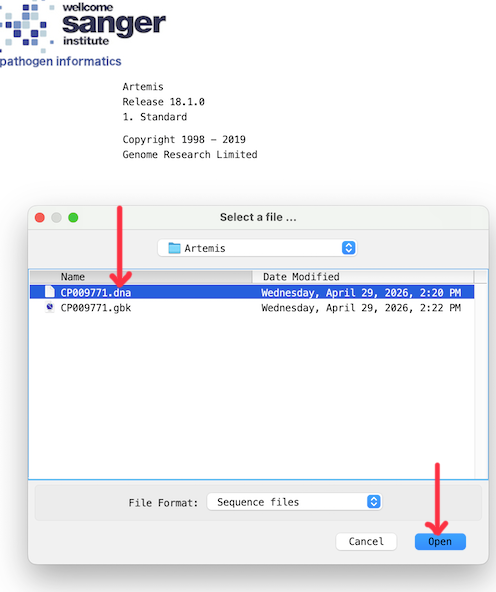

Hopefully you will now have an Artemis window like this! If not, ask a demonstrator for assistance.

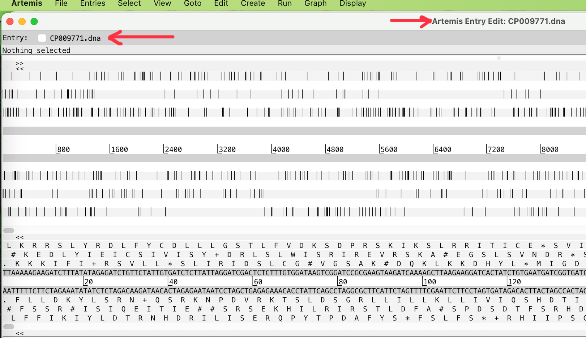

### 2.1.2 Loading an annotation file (entry) into Artemis

Now follow the instructions to load the annotation file for the *Klebsiella pneumoniae* chromosome.

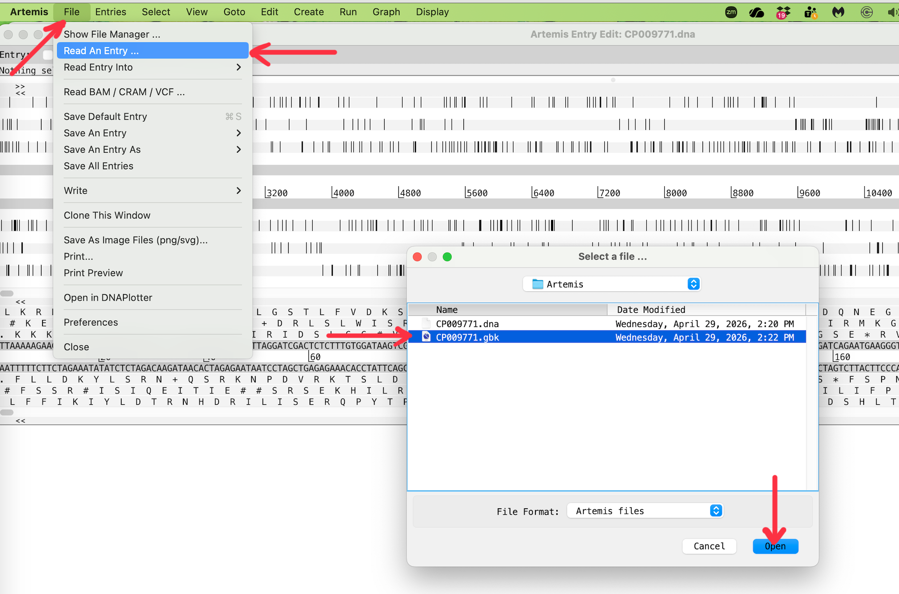

### 2.1.3 The basics of Artemis

Now you have an Artemis window open let’s look at what is in there.

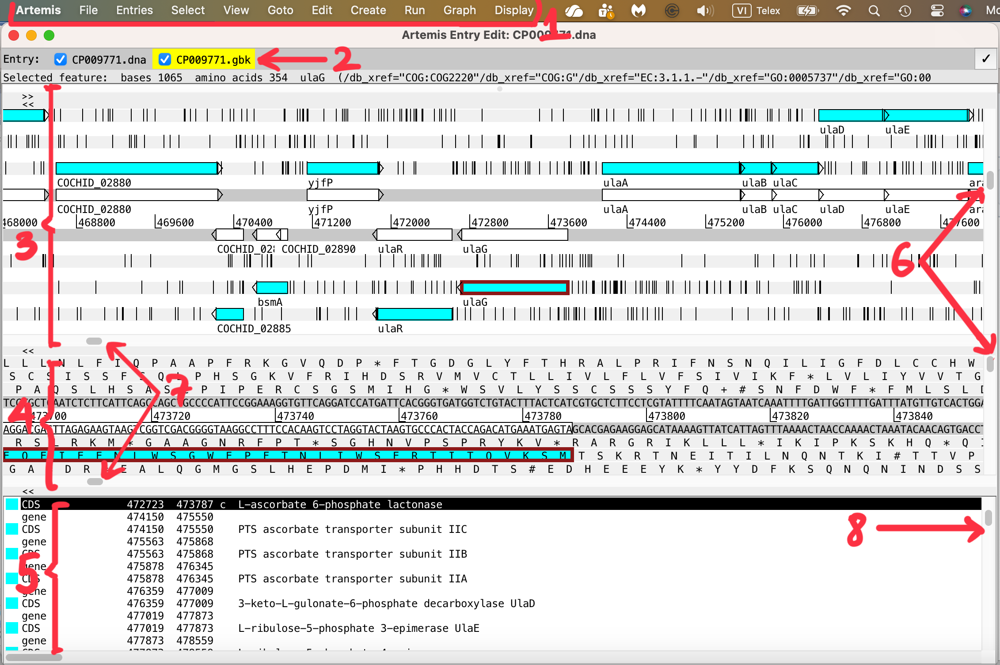

1.  **Drop-down menus:** There’s lots in there so don’t worry about all the details right now.

2.  **Entry (top line):** shows which entries are currently loaded with the default entry highlighted in yellow (this is the entry into which newly created features are created). Selected feature: the details of a selected feature are shown here; in this case gene asnA

3.  **Main sequence view panel:** The central 2 grey lines represent the forward (top) and reverse (bottom) DNA strands. Above and below those are the 3 forward and 3 reverse reading frames. Stop codons are marked on the reading frames as black vertical bars. Genes and other annotated features (eg. Pfam and Prosite matches) are displayed as coloured boxes. We often refer to predicted genes as coding sequences or CDSs.

4.  **Codon translation panel:** This panel has a similar layout to the main panel but is zoomed in to show nucleotides and amino acids. Double click on a CDS in the main view to see the zoomed view of the start of that CDS. Note that both this and the main panel can be scrolled left and right (7, below) zoomed in and out (6, below).

5.  **Feature panel:** This panel contains details of the various features, listed in the order that they occur on the DNA. Any selected features are highlighted. The list can be scrolled (8, below).

6.  **Sliders** for zooming view panels.

7.  **Sliders** for scrolling along the DNA.

8.  **Slider** for scrolling feature list.

### 2.1.4 Getting around in Artemis

There are three main ways of getting to a particular DNA region in Artemis:

A. **the Goto drop-down menu** <br> B. **the Navigator** <br> C. **the Feature Selector** ([2.3 Artemis Practice 3](#artemis-practice-3))

The best method depends on what you’re trying to do. Knowing which one to use comes with practice.

#### A. The ‘Goto’ menu

The functions on this menu (below the Navigator option) are shortcuts for getting to locations within a selected feature or for jumping to the start or end of the DNA sequence. This is really intuitive so give it a try!

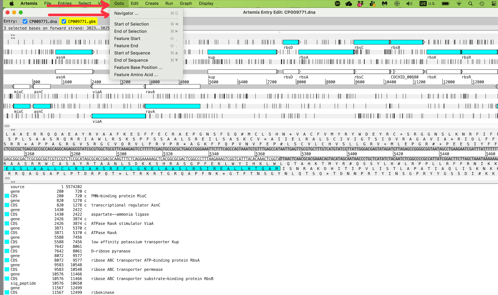

It may seem that **‘Goto’ \> ‘Start of Selection’**, and **‘Goto’ \> ‘Feature Start’** do the same thing. <br> Well they do if you have a feature selected but **‘Goto’ \> ‘Start of Selection’** will also work for a region which you have selected by click-dragging in the main window. So yes, give it a try!

::: {.callout-important title="Suggested tasks"}
1.  Zoom out, select/highlight a large region of sequence by clicking the left hand button and dragging the cursor then go to the start and end of this selected region.
2.  Select a CDS then go to the start and end.
3.  Go to the start and end of the genome sequence.
4.  Select a CDS. Within it, go to a base (nucleotide) and/or amino acid of your choice.
5.  Highlight a region then, from the right click menu, select ‘Zoom to Selection’.
:::

#### B. The Navigator

Before you start this function. **What are Keys and Qualifiers?**

Well, <br> In genome annotation, *“key”* and *“qualifier”* play different roles.

+-------------------------------------------------------------+--------------------------------------------------+
| Key (Feature Key)                                           | Qualifier                                        |
+=============================================================+==================================================+
| - Defines what the feature is                               | - Provides additional details about that feature |
|                                                             |                                                  |
| - Is a standardized label describing the biological feature | - Adds descriptive or functional information     |
|                                                             |                                                  |
| - *Examples*: gene, CDS, mRNA, tRNA, source                 | - Written as `/name=value`                       |
+-------------------------------------------------------------+--------------------------------------------------+


**Example:**

```         
    CDS 1..1700 <------Key

        /gene= "HA" <------Qualifier
        /product="hemagglutinin" <------Qualifier
        /organism="Influenza A virus" <------Qualifier
        /note="surface glycoprotein" <------Qualifier
```

**Now you are ready...!**

The Navigator panel is fairly intuitive so open it up.

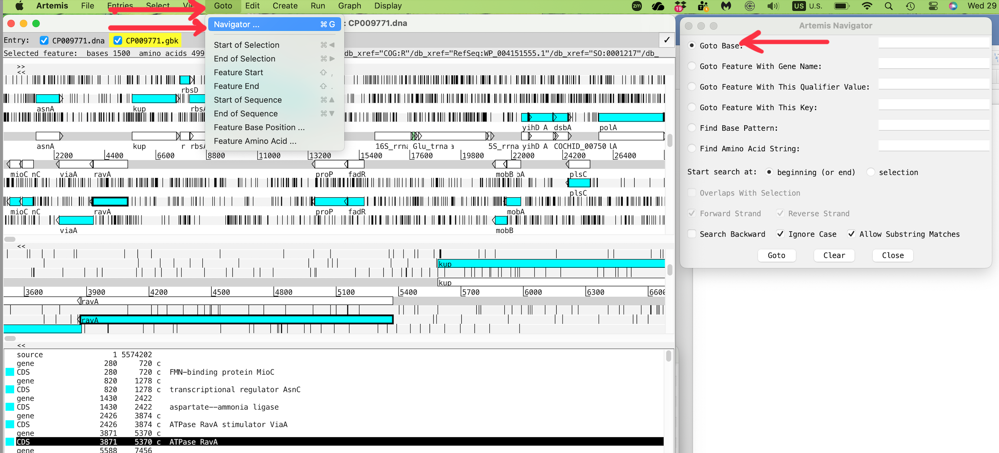

::: {.callout-tip title="Suggestions for where-to-go"}
1.  **'Goto Base'**: Think of a number between 1 and 5574202 and go to that base (notice how the cursors on the horizontal sliders move with you).
2.  **'Goto Feature with Gene Name'**: Your favourite gene name (try ‘blaKPC’). How many blaKPC copies do you find?
3.  Use **‘Goto Feature With This Qualifier value’** to search the contents of all qualifiers for a particular term. For example using the word **‘beta-lactamase’** will take you to the next feature with the word **‘beta-lactamase’** in any of its qualifiers. Note how repeated clicking of the **‘Goto’** button takes you to the following **beta-lactamase** in the order that they occur on the chromosome.
4.  tRNA genes. Type ‘tRNA’ in the **‘Goto Feature With This Key’**.
5.  Try ATGCGCGC in the **'Find Base Pattern'**.
6.  Try DINVG the **'Find Amino acid String'**. Note that it searches all six reading frames regardless of whether the amino acids are encoded or not.
:::

Clearly there are many more features of Artemis which we will not have time to explain in detail. Before getting on with this next section it might be worth browsing the menus. Hopefully you will find most of them easy to understand.

## 2.2 Artemis Practice 2

There are many examples where anomalous regions of DNA within a genome have been shown to carry laterally acquired DNA. In this part of the exercise we are going to look at several of these regions in more detail.

**Commmon characteristics of those regions:**

1.  Often inserted alongside stable RNAs
2.  Atypical G+C contents.
3.  Carry virulence-related functions
4.  Often carry genes encoding transposase or integrase-like proteins
5.  Unstable and self-mobilisable
6.  Of limited phylogenetic distribution

First, we will open GC content (%) plot. Use "Graph" function --\> select GC content (%). You should see the graph like this:

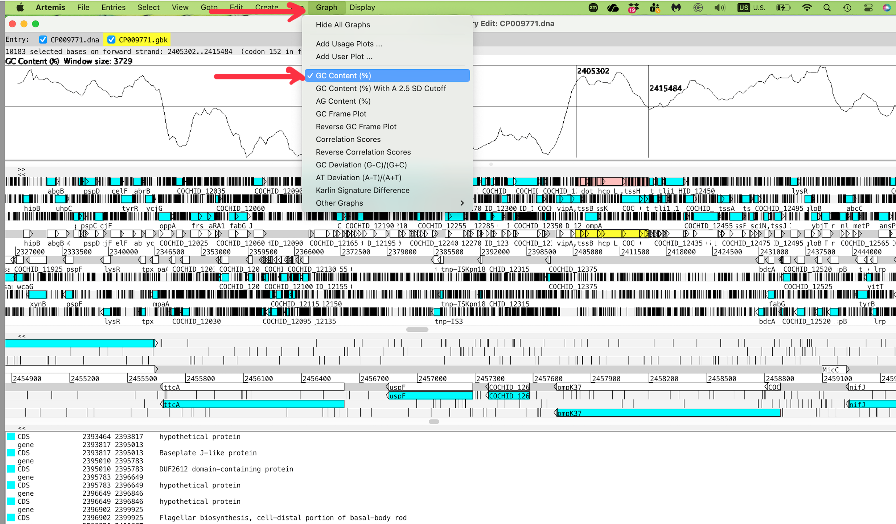

Now, **adjust the window size to 20000 by** right click at the GC plot\*\* --\> **set the window size** --\> enter **20000**; after that, deselect "stop codon"\*\*

*You should see a graph like this:*

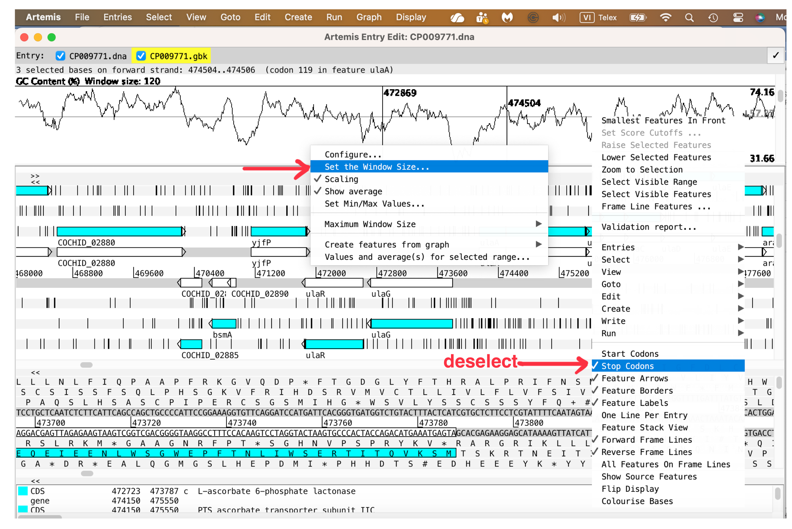

In Artemis, a window size of about 20,000 bp is used for GC content plots because smaller windows can make the graph look very uneven and hard to interpret due to natural small changes in DNA sequence. Using a larger window smooths out these short fluctuations and makes overall patterns easier to see. This is important because unusual DNA regions, such as those acquired from other organisms, are usually larger stretches of DNA and tend to show a consistent difference in GC content that becomes clearer at this scale. Feel free to adjust the GC content (%) window size by sliding the button up and down. The GC plot below shows the same genomic region at different **GC content (%) window sizes: 20; 200; 2000; and 20000.**


Now use the slider to zoom out and view the GC% plot of the full genome.

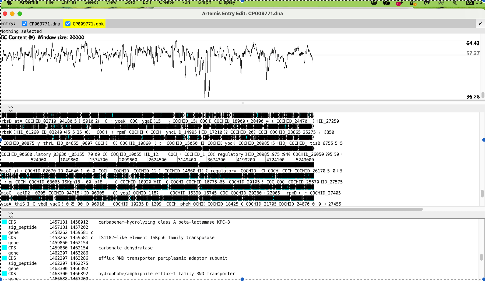

::: {.callout-tip title="Can you spot any specific anomalous regions?"}
:::

Let's zoom in this region: *Region 1: 1785159..1835508.*

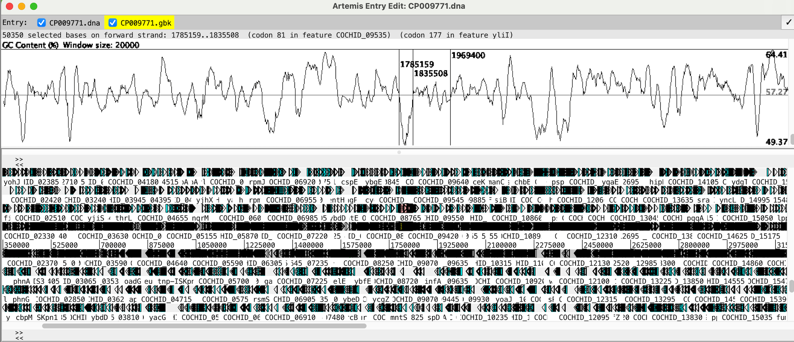

To do so, use the **"Select"** function --\> **"Base Range"** --\> **"enter a range of bases"** --\> input **"1785159..1835508"** --\> **OK** --\> Zoom in using the slider

You should see the region 1 zoomed in like this:

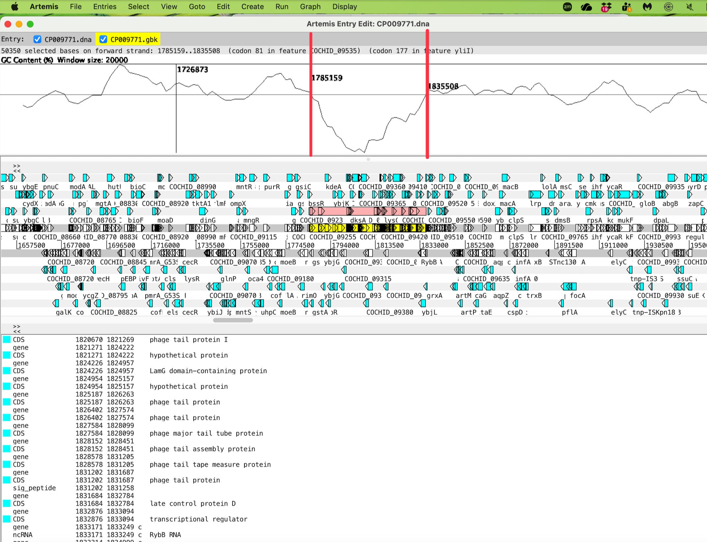

::: {.callout-important title="Plese let us know if you can't find the region 1!"}
:::

::: {.callout-tip title="Challenge your curiosity"}
What is interesting about this genomic region?

Why do you think its GC content is lower than the average genomic GC content?
:::

Let's continute to investigate the second region: *Region 2: 3429511..3739184.*

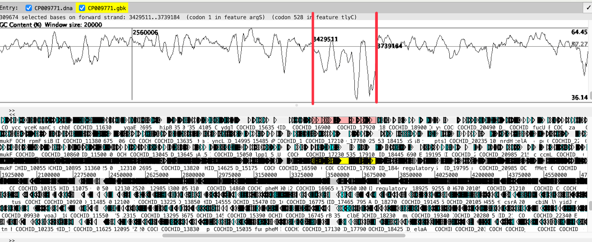

First, we need to zoom in on this region. Again, use the **"Select"** function --\> **"Base Range"** --\> **"enter a range of bases"** --\> enter **"3429511..3739184"** --\> click **OK** --\> Zoom in using the slider.

You should see the region 2 zoomed in like this:

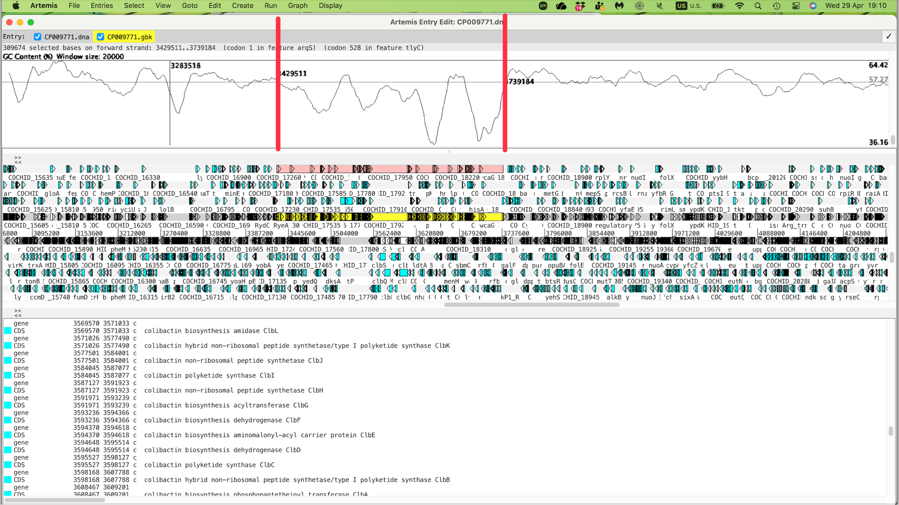

This is a large genomic region.

::: {.callout-tip title="How many interesting loci can you identify, and what are their functions?"}
:::

## 2.3 Artemis Practice 3 {#artemis-practice-3}

Now we can move to **gene annotation** and **selecting/extracting features** using the **Feature Selector**.

This reference genome was annotated using Bakta, but genome annotations are not always complete or fully accurate. Automated tools rely on existing databases and prediction algorithms, which may miss genes, assign incorrect functions, or label proteins as “hypothetical” when no close match is available. In addition, scientific knowledge is constantly evolving, and new research may reveal updated or more precise functions for previously annotated genes. Therefore, genome annotation should be considered an ongoing process that can be improved by manual curation, comparison with new data, and updated literature.

### 2.3.1 Add features

In this exercise, we will focus on the *blaKPC-3* region to examine the genetic context of this gene.

First, nagivate to this region using the **"Select"** function --\> **"Goto"**--\> **"Goto Feature with Gene name"** --\> enter **"COCHID_07645"** --\> click **"Goto"**. <br> This gene is located within the blaKPC-3 region and its annotation can be improved.

Next, press **“E”** on your keyboard (**a shortcut to edit the selected feature**) to review the current annotation of COCHID_07645. <br> You can see that there is currently no "gene name". We can fix it by adding **/gene=ISKpn6** and **/color=2** to the qualifiers to indicate that the gene is *ISKpn6* and to highlight it in *red* color.

*You should see a view similar to the figure shown below.*

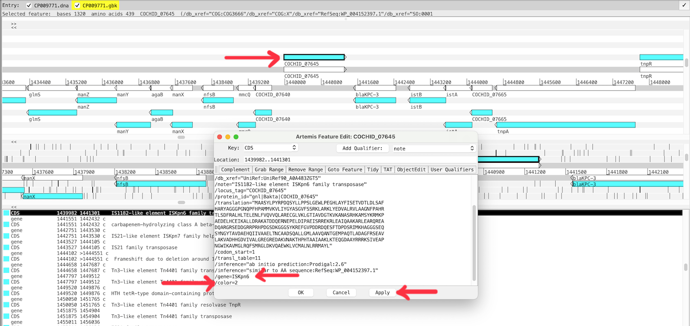

This is how the annotation of the gene changes after editing.

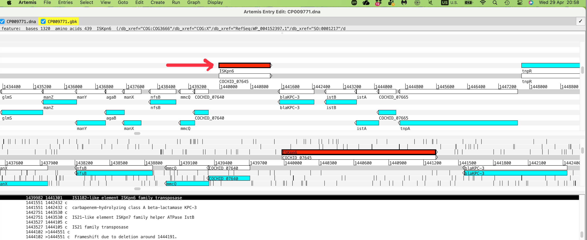

::: {.callout-tip title="Can you spot the difference?"}
:::

Now, continue to highlight the region by adding `/color=2` (red) to the other genes in this region. Also, update **locus_tag COCHID_07710** by adding `/gene=ISKpn6` and `/color=2`, as this is also an *ISKpn6* gene.

After completing these steps, your view should look similar to the figure below.

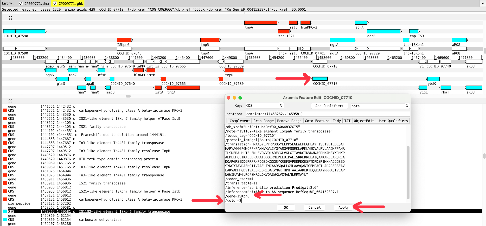

The *blaKPC-3* gene is actually mobilized by the **transposon Tn4401d** in this strain. There are two identical copies of **Tn4401d** in this genomic region, and we will add annotations for both.

- First region: **1439982..1449512**
- Second region: **1450050..1459581**

To add the 1st region to the annotation, use the **“Select”** function --\> **“Base Range”** --\> enter **1439982..1449512** --\> click **OK** --\> Zoom in using the slider --\> **right-click** --\> **“Create”** --\> **“Feature from base range”** to create a new feature for the region.

*Your view should look similar to the figure below.*

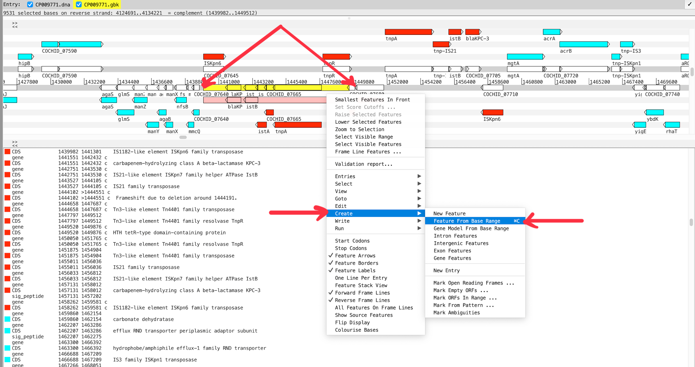

Now, add an annotation by selecting **"mobile_element"** as the **Key** and entering the qualifiers `/note="transposon Tn4401d"` and `/color=7`.

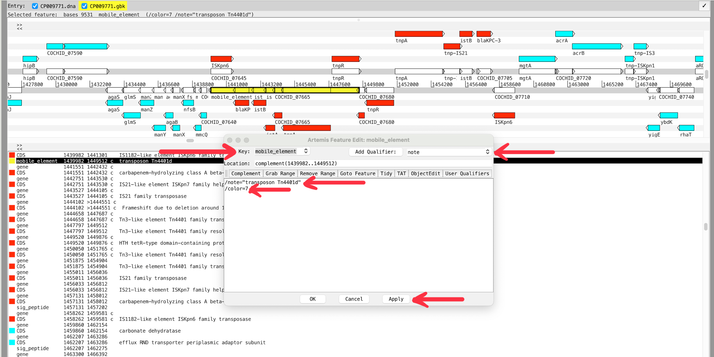

Continue to annotate the *second region 1450050..1459581*, following the above instructions.

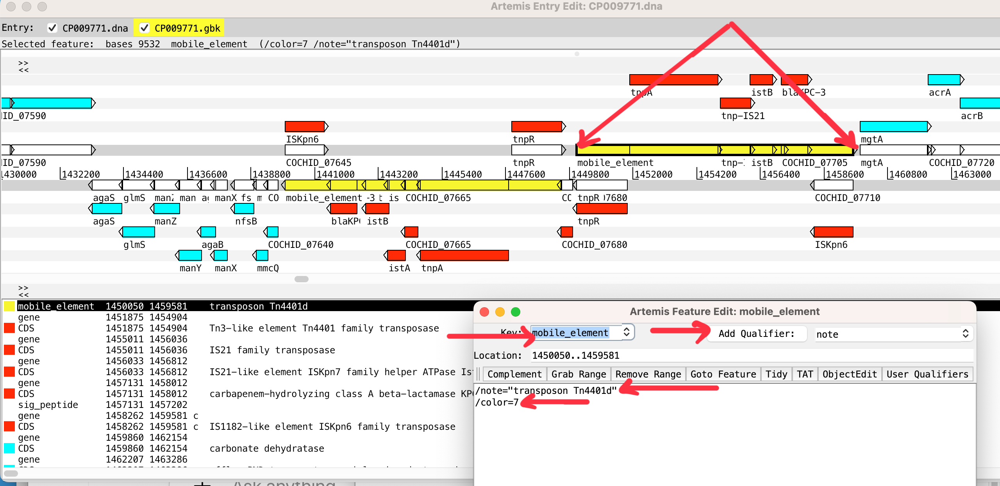

::: {.callout-warning title="Please let us know if you need help!!"}
:::

### 2.3.2 Extract features

Features in the genome annotation also can be selected and extracted using the **Feature Selector**.

The region that we will extract both DNA sequence and annotation is from **1439982..1459581**, containing the two *Tn4401d* copies that we just annotated above.

First, use the **“Select”** function --\> **“Base Range”** --\> enter **1439982..1459581** --\> click **OK**. <br> The whole region should be highlighted.

Then, chose **"Select"** --\> **"Features within selection"**. <br> This will highlighed all selected features within this region for extraction.

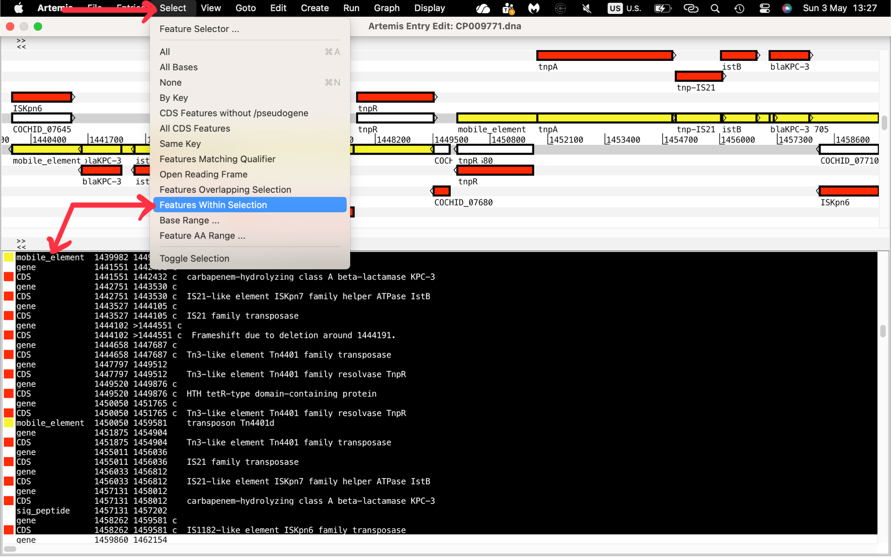

Next, chose **"Edit"** --\> **Subsequence (and Features)**

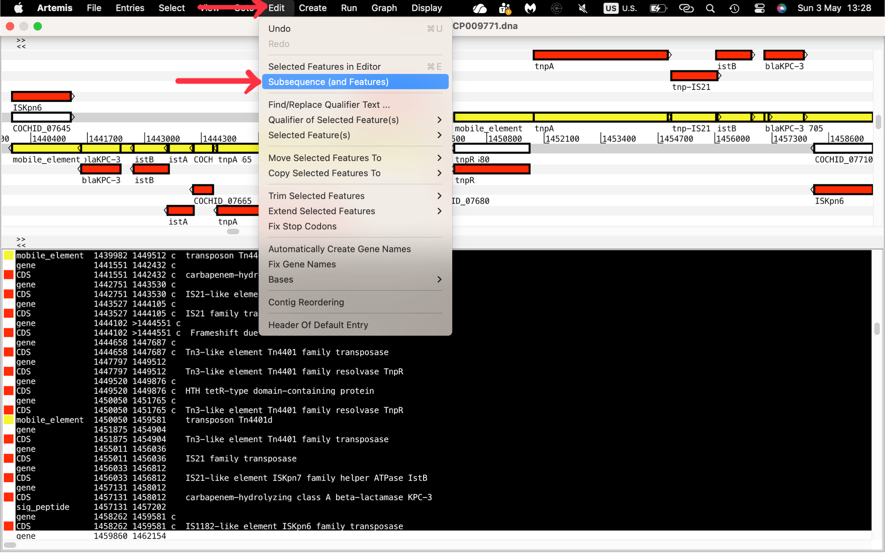

A new window will appear:

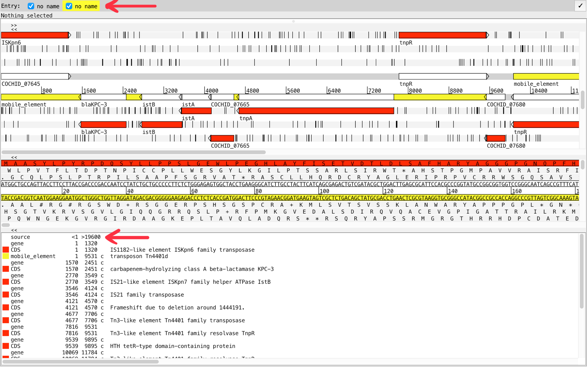

Note that the two entries on the grey ‘Entry’ line are now denoted **"no name"**. They represent the same information in the same order as the original Artemis window but simply have no assigned ‘Entry’ names. As the sub-sequence is now viewed in a new Artemis session, this prevents the original files **(CP009771.dna and CP009771.gbk)** from being over-written.

Because the two entries **(“no name” and “no name”)** contain different types of information: first entry with the **DNA sequence** and the second entry with **annotations**, we have two options: - **Save them as two separate files (one for sequence, one for annotation)**, or - **Merge them into a single file by copying all annotation features into the DNA sequence file**, so that it contains both sequence and annotation information.

This is how we do the merging. First, select all features by using **“Copy All”** in the **Feature Selection** window.

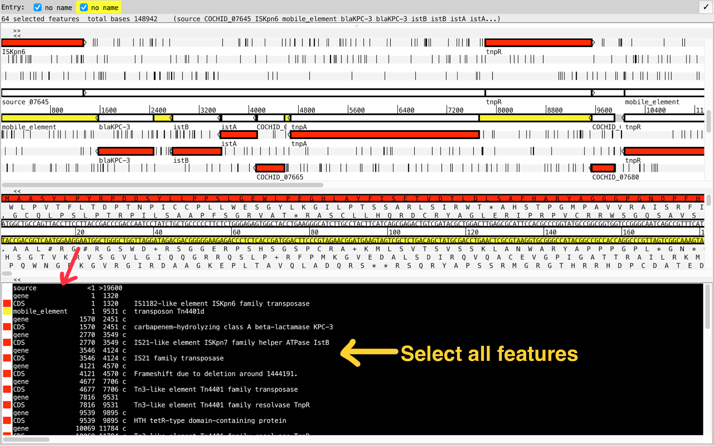

Next, go to **“Edit”** --\> **“Copy Selected Features To”**, then select **“No name” (first entry)**.

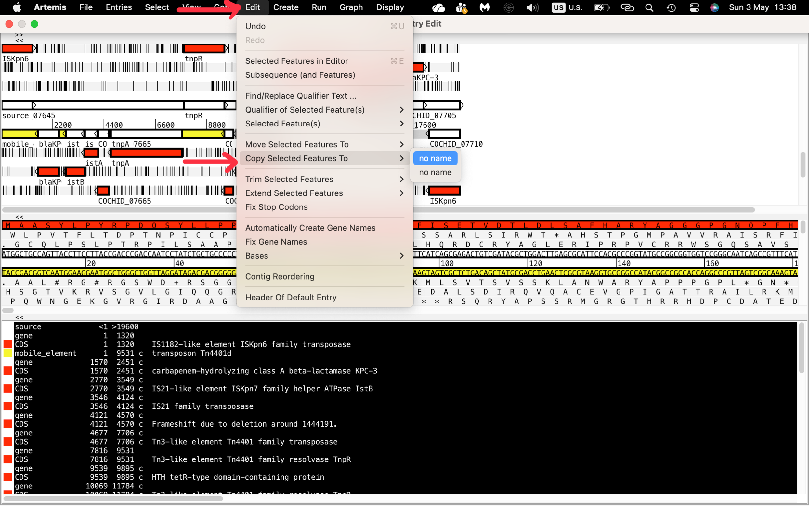

Now we are ready to save the **“No name” entry** into a file containing both the DNA sequence and its annotations.

Go to **“File”** --\> **“Save an entry as”** --\> **“GenBank format”**, then select **“No name” (first entry)** (now containing both DNA sequence and annotation) and enter the file name **“blaKPC_transposon_Tn4401d”.**

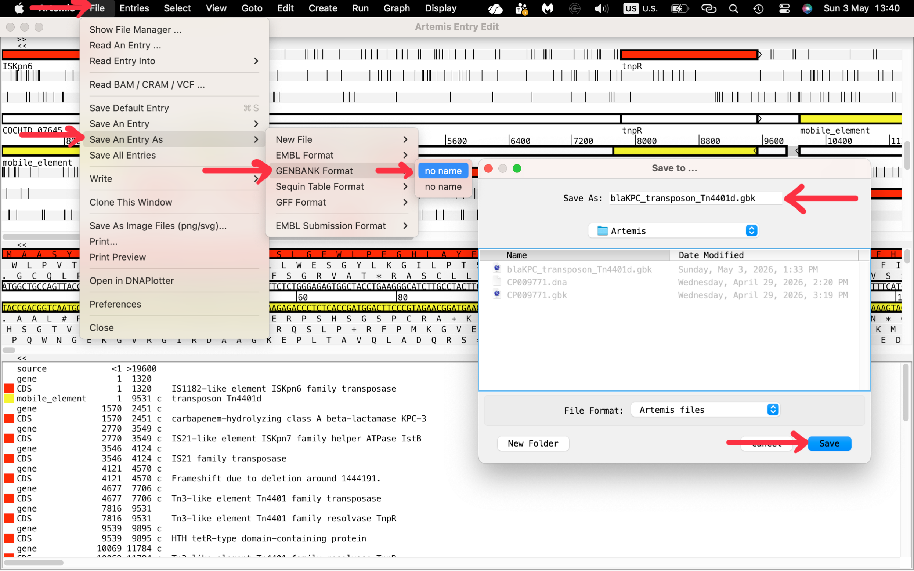

Now, open the newly saved file in Artemis to verify it!!!

::: {.callout-note title="Notes for saving files" collapse="true"}
You can save the ARTEMIS working files using the same format:

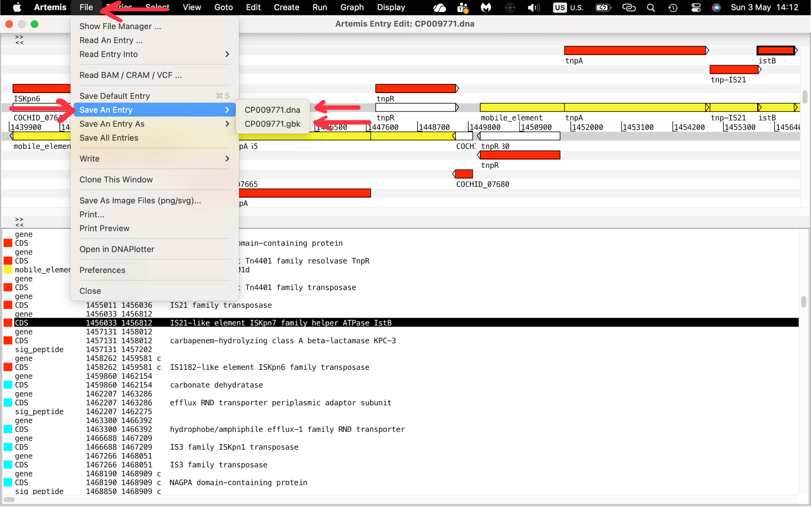

**OR** save the files in different formats if you need a specific format for submissions or future uses:

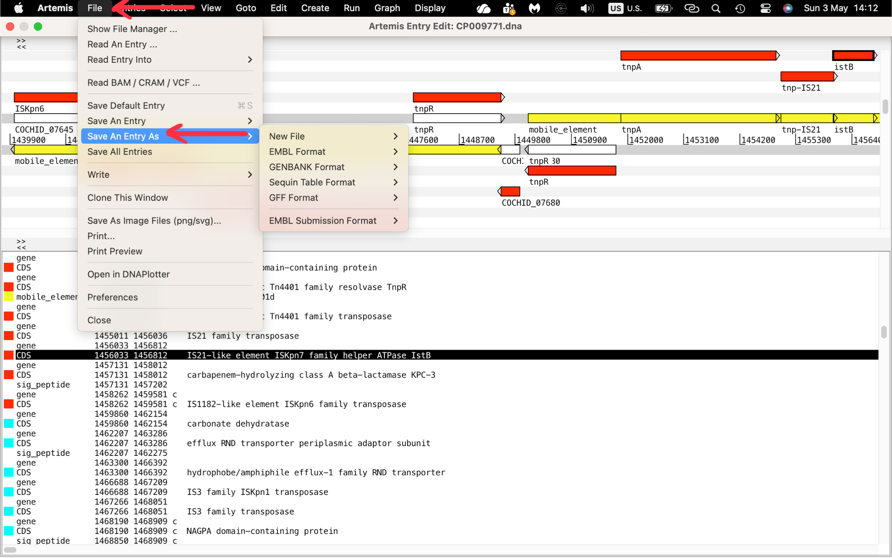

Try different **"Save As" options** and reopen the saved files to verify them.
:::