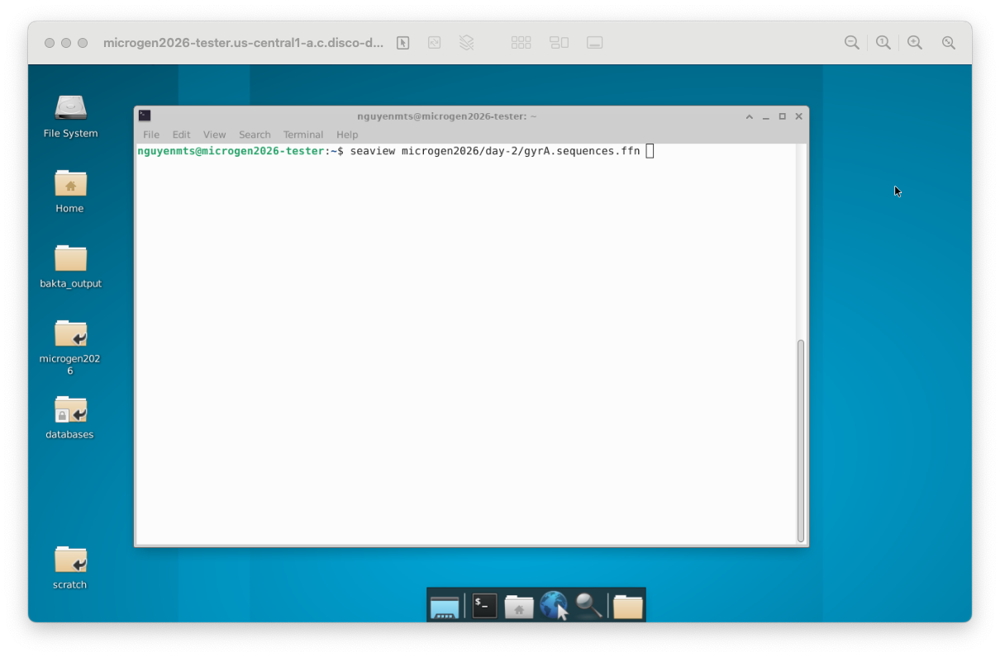
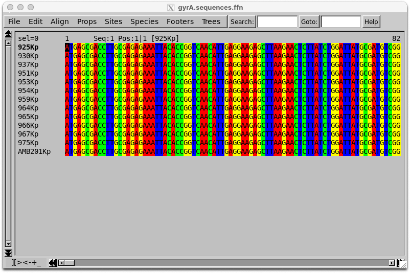
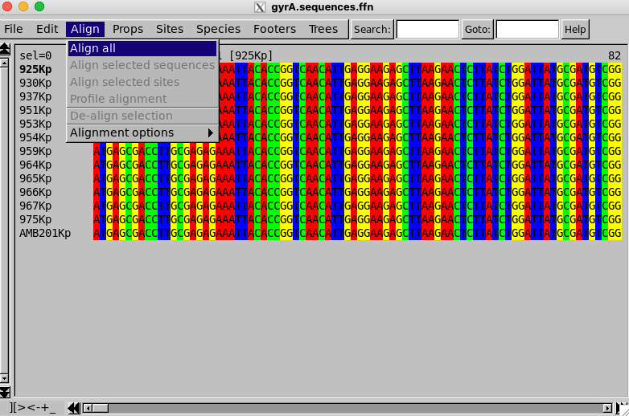
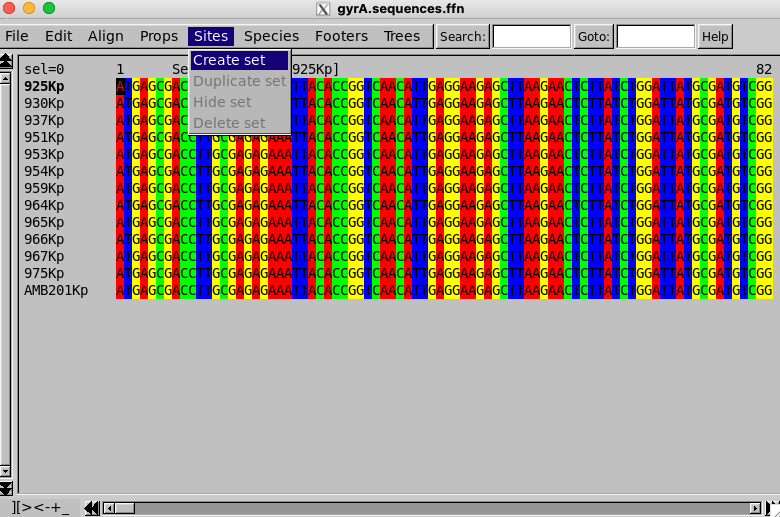
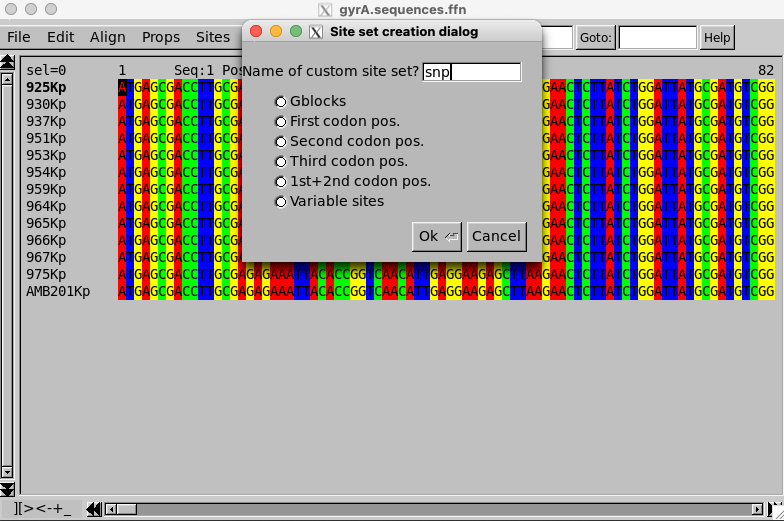
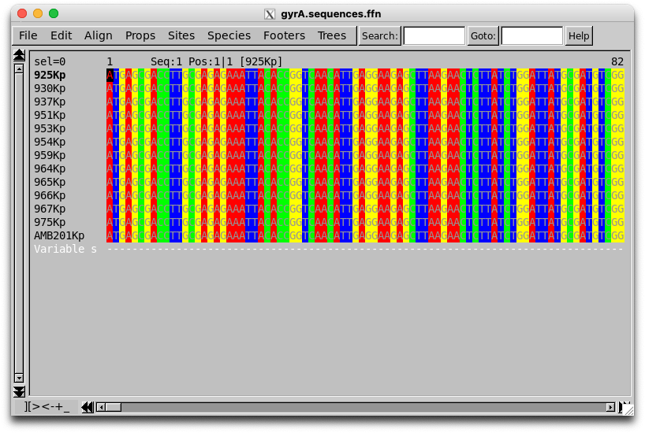
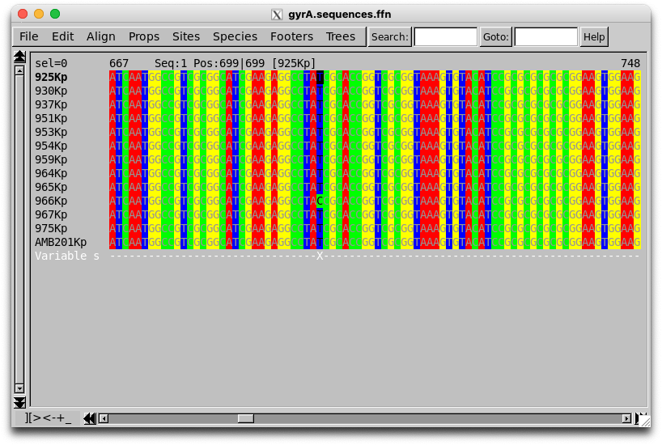
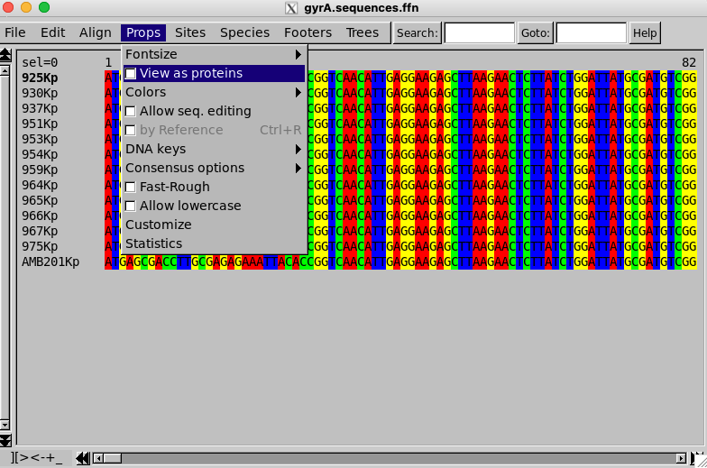
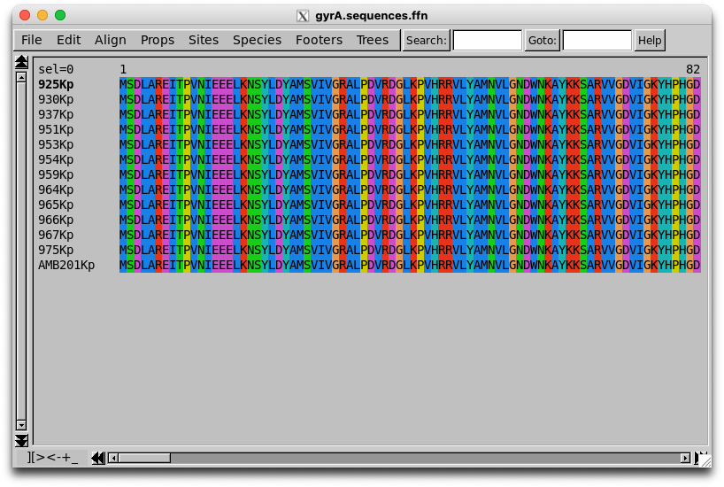
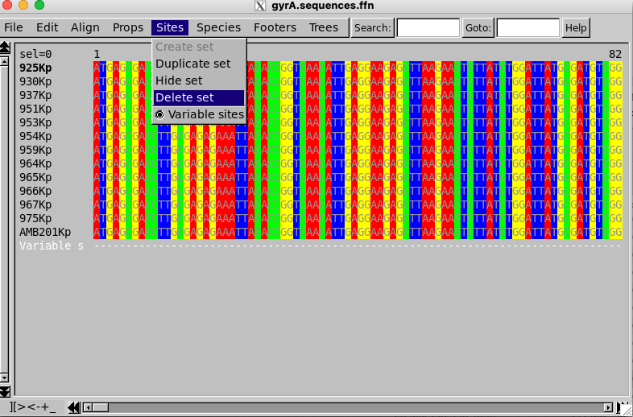

# Gene alignment

Gene alignment, or sequence alignment, is a fundamental technique in bioinformatics used to arrange DNA, RNA, or protein sequences to identify regions of similarity, and dissimilarity. <br>
These similarities and dissimilarities often indicate functional, structural, or evolutionary relationships between the sequences.

In bacterial genomics, alignment allows researchers to pinpoint mutations — such as Single Nucleotide Polymorphisms (SNPs) — and understand how pathogens evolve and spread.

# *gyrA* mutations in fluoroquinolone-resistant *K. pneumoniae*

Fluoroquinolones are broad-spectrum antibiotics that target bacterial DNA gyrase and topoisomerase IV, enzymes essential for DNA replication. The *gyrA* gene encodes the A subunit of DNA gyrase. Mutations within the Quinolone Resistance-Determining Regions (QRDR) of *gyrA* are the primary drivers of fluoroquinolone resistance in *Klebsiella pneumoniae*. 

High-risk clones like ST147 often harbor these chromosomal mutations alongside other resistance genes, making them challenging to treat in clinical settings.

In this module, we will focus on the *gyrA* gene to learn about gene alignment and how to identify variations among sequences.

Now, let's compare!

## Multiple sequences on Seaview

The *gyrA* sequences of all samples were extracted and concatenated into the file `gyrA.sequences.ffn` under the directory `/microgen2026/day-2/`.

To view them, we will use a graphical software called **Seaview**. You can let it run directly on the Google Cloud instance and access to it remotely, either via X11 forwarding or VNC virtual desktop. This is guided in more detail on [day-0](../../day-0/instructions/setup-environment.qmd). <br>

The below command opens the file with Seaview from a terminal:

```{.bash filename="Practice"}
seaview /microgen2026/day-2/gyrA.sequences.ffn
```

and the below figure shows it was done on a VNC virtual desktop of the Google Cloud instance:



Once successful, you shall see the sequences on Seaview like below:



:::{.callout-important title="Please reach us if you get any issue opening Seaview!"}
:::

:::{.callout-note collapse="true"}
## Challenge
Do you know how to identify & extract the sequence of *gyrA* from an assembly `.assembly.fasta` file? <br>
*Hint: You should not use BLAST on Bandage. It's too manual. We're doing this for a reason.*

This is a group exercise in the class. Discuss with your peers about the steps you would take to solve this challenge. You don't need to come up with command-lines or codes, just the logical steps. We will then go through the solutions together.

<details>

<summary>Solution</summary>

</details>

:::

## DNA sequence alignment

To align the DNA sequences, choose the **"Align"** menu, then **"Align all"**.



After that, we will need to find the positions where the sequences differ, e.g. the Single-Nucleotide Polymorphisms (SNPs).

You can do this through the **"Sites"** menu, then **"Create set"**.



Name the set as *"snp"* and choose the set type **"Variable sites"**, then click **"OK"**.

::: {layout-ncol=2}



:::

When done, you should see a new line under the sequences with name *"Variable sites"*. In this "sequence", the positions with different nucleotides will be annotated as **"X"** and un-variable sites will be **"-"**.

You can click to a site, especially one with the **"X"** mark, to see the position number of the SNP in the alignment. For example, clicking to the first **"X"** site shows that it is the 699th position in the alignment.

::: {layout-ncol=2}



:::

### Exercise

- How many SNPs are there in the *gyrA* sequences of our *K. pneumoniae* ST147 isolates?

## Protein sequence alignment

As we all know, changes in DNA sequence may not lead to changes in phenotype. To see if there are any changes in the protein sequences, we can translate the DNA sequences to amino acid sequences and align them directly on Seaview.

Let's first translate the DNA sequences to amino acid sequences. You can do this through the **"Props"** menu, then **"View as proteins"**.



Once done, you should see the amino acid sequences like below.



Now, to find the amino acid positions that differ, we just need to repeat the same steps as before, to create a new set of variable sites for the protein sequences. <br>
But, before that, we need to delete the previous set of variable sites, which was created for the DNA sequences. You can do this through the **"Sites"** menu, then **"Delete set"**.



### Exercise

- How many amino acid positions differ among the *gyrA* sequences of our *K. pneumoniae* ST147 isolates?
- What are they? Are they related to fluoroquinolone resistance (e.g. findings from Kleborate analysis)?

## Compare with a reference wild-type sequence

If all sequences in our samples have a same resistant mutation, we probably cannot spot it from the alignment of only our samples, as it will not be marked as a variable site. <br>
Therefore, we will also need to add a "wild-type" sequence to the alignment to compare with.

In the same directory `/microgen2026/day-2/`, you can find a reference sequence of *gyrA* that was used by Kleborate as a wild-type for identifying fluoroquinolone resistance mutations: `gyrA-reference-kleborate.fasta`.

Your tasks are as follows:

1. Add this reference sequence to the alignment in a new file named `gyrA.sequences.plusRef.ffn`.
2. Open the new file with Seaview and find the amino acid mutations that correspond to fluoroquinolone resistance in our *K. pneumoniae* ST147 isolates.
3. Check your results with the findings from Kleborate analysis in module 2.1. 
4. Did you see that the reference sequence from Kleborate is shorter than the *gyrA* sequences of samples? Can you guess why?

