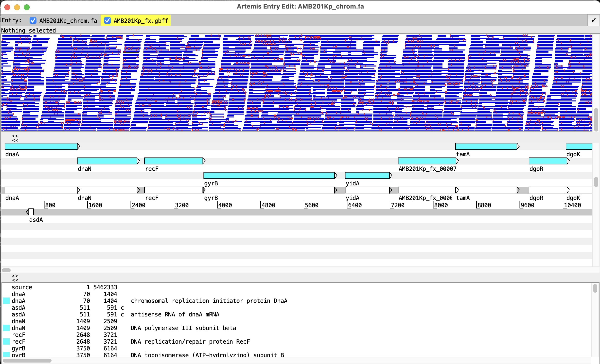
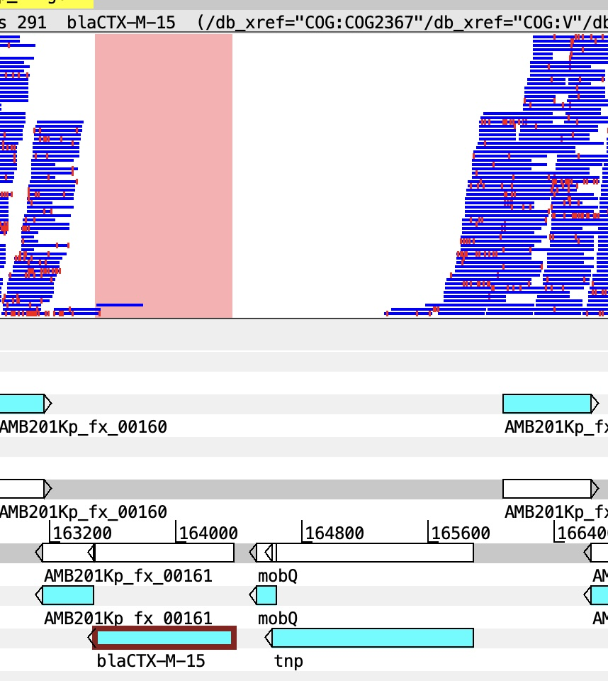
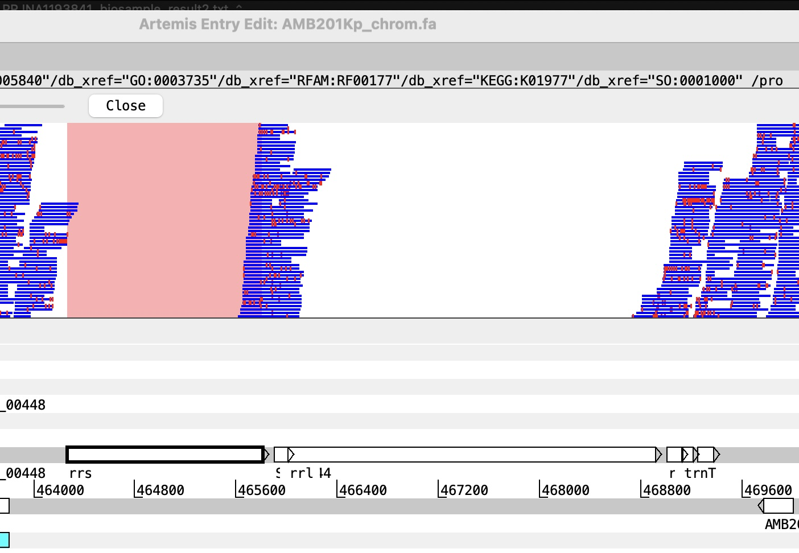

# Introduction

Mapping, on theory, is a straightforward concept. However, in practice, mapping is a complex process with multiple steps and considerations. The most crucial step is not mapping *per se*, but on filtering mapped reads and variants to retain only high-quality ones. This is particularly important if you are working with potentially closely related genomes (e.g. in an outbreak), where the number of variants can be very low, and the impact of false positives variant detection (SNPs) can lead to misleading conclusion.

# Data directory

Input data are available in `day-3/mapping/input` directory. The reference genome is `AMB201Kp_chrom.fa`, and the paired-end read files for each sample are named in the format `sampleID_1.fastq.gz` and `sampleID_2.fastq.gz`.

The reference genome for this exercise is taken from the previous `day-2` hybrid assembly step. Note that we only use the chromosomal sequence of `AMB201Kp`

Also first activate the main conda environment we will be working with

# Mapping command step by step

***Disclaimer***: There is no one universal best practice for read mapping. The process described herein is just one example of how mapping is performed for bacterial genomics.

## 1. Indexing the reference genome

The goal of mapping is to align the sequencing reads to a reference genome. In this example, we will use the BWA-MEM2 algorithm for mapping. First, we need to index the reference genome using the `bwa-mem2 index` command. This step creates the necessary index files for efficient mapping.

``` bash
bwa-mem2 index AMB201Kp_chrom.fa # indexing the reference genome
ls -l
```

## 2. Mapping the reads to the reference genome

First we will conduct mapping for one sample, 925Kp, which has paired-end reads (`925Kp_1.fastq.gz` and `925Kp_2.fastq.gz`). 

We will use the `bwa-mem2 mem` command to perform the mapping, with

- `-t 8` option allows us to use 8 threads for faster processing
- output will be saved in a SAM file named `925Kp_bwamem2AMB201Kp.sam`. It is important to note that the output file name should reflect the reference genome used for mapping, in this case, AMB201Kp.

``` {.bash }
# mapping forward and reverse reads to the reference genome, and saving the output in SAM format
bwa-mem2 mem -t 8 AMB201Kp_chrom.fa 925Kp_1.fastq.gz 925Kp_2.fastq.gz > 925Kp_bwamem2AMB201Kp.sam 
ls -l
```

## 3. Converting SAM to BAM format

After mapping, we will convert the SAM file to BAM format using `samtools view`, with
- `-bS` option specifies that the input is in SAM format and the output should be in BAM format. 
- resulting BAM file will be named `925Kp_bwamem2AMB201Kp_tmp.bam`. 
- `-q 30` option filters the alignments to include only those with a mapping quality of at least 30, ensuring that we retain high-quality mappings.

``` {.bash }
# converting the SAM file to BAM format
samtools view -t 8 -q 30 -bS 925Kp_bwamem2AMB201Kp.sam > 925Kp_bwamem2AMB201Kp_tmp.bam 
```

## 4. Removing reads with long soft/hard clipping and sort bam file:

Reads can be poorly mapped to the reference, which can be indicated by long soft or hard clipping in the CIGAR string. Since most aligners, including BWA-MEM2, use local alignment, this means the *ends* of reads may not be part of the best alignment. This can be caused by:

- adapter sequences not cleanly filtered
- structural variations in your sample compared to the reference
- mapping to repetitive regions of the genome

In the SAM file, Column 6 (CIGAR string) describes how the read aligns to the reference. The CIGAR string can contain various operations, including matches (M), insertions (I), deletions (D), soft clipping (S), and hard clipping (H). Soft clipping (S) indicates that a portion of the read is not aligned to the reference, while hard clipping (H) indicates that a portion of the read is not present in the alignment at all. Soft and hard clipping don't mean biological differences, they just indicate whether a full read sequence is in the SAM file.

To remove reads with long soft/hard clipping, we can use `samclip` to allow the maximum soft/hard clipping length of xx bp (xx=10). This means that any read with more than 10 bp of soft or hard clipping will be filtered out. This strict setup is preferred to ensure mismapped reads are removed, allowing for more accurate variant calling in downstream analysis. This filter is particularly significant to infer differences in very closely related samples, such as in an outbreak.

``` {.bash }
samtools faidx AMB201Kp_chrom.fa # first need indexing the reference genome for samclip
# removing reads with long soft/hard clipping and sorting the BAM file
samtools view -h 925Kp_bwamem2AMB201Kp_tmp.bam | samclip --max 10 --ref AMB201Kp_chrom.fa | samtools sort -t 8 > 925Kp_bwamem2AMB201Kp_clip.bam
```

We combined the filtering of reads with long soft/hard clipping and sorting the BAM file into one command. The resulting BAM file after filtering will be named `925Kp_bwamem2AMB201Kp_clip.bam`. Sorting the BAM file is important for downstream analysis, such as variant calling, as it allows for efficient access to the alignments based on their genomic coordinates.

## 5. Indexing the sorted BAM file

``` {.bash }
# indexing the sorted BAM file for downstream analysis
samtools index 925Kp_bwamem2AMB201Kp_clip.bam 
```

## Extra: Visualizing mapped reads on reference

***Exercise***: Load the sorted clipped bam file onto reference using Artemis to visualize the coverage and depth of mapped reads.

Following these steps:

- Open Artemis and load the reference genome `AMB201Kp_chrom.fa` . Also read the annotation file `AMB201Kp_fx.gbff`

- Load the sorted BAM file `925Kp_bwamem2AMB201Kp_clip.bam` in `File > Read BAM/CRAM/VCF ...`. Make sure your index `bam.bai` file is in the same directory as the BAM file.

- Visualize the coverage and depth of mapped reads across the reference genome. Try right clicking in the bam window and select `View > Paired Stack` to visualize paired-end reads. You can also visualize variants by select `Show > SNP marks` to view *TRUE SNPS*. What should be the feature of a true SNP?

  {width="758"}

***Question***: Navigate to region 162400 - 167200; 464000 - 469000. What are the potential explanations for regions without mapped reads?

{fig-align="left" width="402"}

{fig-align="right" width="550"}

You can continue exploring the Artemis portal, but don't close it down just now.

## 6. Variant calling using FreeBayes

After obtaining the sorted and indexed BAM file, we can proceed with variant calling using FreeBayes. FreeBayes is a haplotype-based variant caller that can identify single nucleotide polymorphisms (SNPs) and small insertions/deletions (indels) from the aligned reads.

``` {.bash }
# calling variants using FreeBayes
freebayes -f AMB201Kp_chrom.fa -p 1 -C 4 925Kp_bwamem2AMB201Kp_clip.bam | bcftools filter -e 'QUAL < 30 | (INFO/AO)/(INFO/DP) <0.6'| vcfallelicprimitives -k > 925Kp_bwamem2AMB201Kp_frb.vcf

# creating a sequence dictionary for the reference genome, which is required for GATK tools
gatk CreateSequenceDictionary -R AMB201Kp_chrom.fa
# Improve accuracy of calling indels
gatk LeftAlignAndTrimVariants -R AMB201Kp_chrom.fa -V 925Kp_bwamem2AMB201Kp_frb.vcf -O 925Kp_bwamem2AMB201Kp_frb_naive.vcf
```

In this command, we specify the reference genome using the `-f` option, set the ploidy to 1 using the `-p` option (bacterial genome is haploid), and set a minimum alternate allele count of 4 using the `-C` option. The output is then filtered using `bcftools filter` to retain (-e means excluding) only variants with a quality score of at least 30 and an allele frequency of at least 0.6. Finally, we use `vcfallelicprimitives` to decompose complex variants into simpler ones, and the resulting VCF file is named `925Kp_bwamem2AMB201Kp_frb.vcf`.

One drawback of Freebayes is that it does not perform local realignment around indels, which can lead to misaligned reads and inaccurate variant calls. To address this issue, we can use GATK's `LeftAlignAndTrimVariants` tool to left-align and trim the variants in the VCF file. This step helps to improve the accuracy of variant calls by ensuring that indels are properly aligned and represented in the VCF file. The output of this step is saved in a new VCF file named `925Kp_bwamem2AMB201Kp_frb_naive.vcf`.

``` {.bash code-line-numbers="true"}
more 925Kp_bwamem2AMB201Kp_frb_naive.vcf ## inspecting the VCF file
```

## 7. Filtering variants using bcftools

After variant calling, we can further filter the variants using `bcftools filter` to retain only high-quality variants. This is important to discern closely related genomes. Without controlling for this step, we can artificially inflate the number of variants between closely related samples, which can lead to inaccurate conclusions about their relatedness. By applying stringent filters, we can ensure that only reliable variants are retained for downstream analysis, such as phylogenetic inference.

``` {.bash }
# First define the criteria for low quality variants and generate a VCF file with low-quality variants
bcftools filter -i 'MQM < 30 | (INFO/AO)/(INFO/DP) < 0.9 | (SAF<1 | SAR<1)' 925Kp_bwamem2AMB201Kp_frb_naive.vcf > 925Kp_bwamem2AMB201Kp_frb_lowqualsnp.vcf 
# filter -i means inclusion of variants matching the criteria to the outfile
# generating a text file with the positions of low quality SNPs. These will be masked in the final pseudogenome file
grep '^AMB201Kp' 925Kp_bwamem2AMB201Kp_frb_lowqualsnp.vcf | grep "TYPE=snp" | awk '{print $1,'\t',$2}' > 925Kp_bwamem2AMB201Kp_frb_lowqualsnp_pos.txt 

# In contrast, use bcftools filter -e with the same criteria to output high-quality variants into a separate VCF file
bcftools filter -e 'MQM < 30 | (INFO/AO)/(INFO/DP) < 0.9 | (SAF<1 | SAR<1)' 925Kp_bwamem2AMB201Kp_frb_naive.vcf > 925Kp_bwamem2AMB201Kp_frb_highqualsnp.vcf 

# compressing the high-quality VCF file
bgzip 925Kp_bwamem2AMB201Kp_frb_highqualsnp.vcf 
# indexing the compressed high-quality VCF file for downstream analysis
tabix -p vcf 925Kp_bwamem2AMB201Kp_frb_highqualsnp.vcf.gz 
```

In this command, we apply filters to retain only variants with a mapping quality (MQM) of at least 30, an allele frequency of at least 0.9, and sufficient support for both forward and reverse reads (SAF and SAR). This is stored in the `highqualsnp.vcf` file. We also extracted positions of low-quality SNPs into a separate file.

***Exercise***: loading the high-quality VCF file into Artemis and visualizing the variants in the context of the reference genome.

From the already-open Artemis window, select `File > Read BAM / CRAM / VCF ...` and open the `925Kp_bwamem2AMB201Kp_frb_highqualsnp.vcf.gz` file. Note that the tabix file `.tbi` needs to be present in the same directory for this to work. Navigate to the only retained high-quality SNP in the file. What is it position?

***Questions***

- What is the character of SNP mark at this high-quality SNP position?

- Does this variant fall into coding or non-coding sequence/

- If coding sequence, what is the impact of this mutation on the protein function?

***Exercise extra***: Inspsect the naive vcf file before filtering `925Kp_bwamem2AMB201Kp_frb_naive.vcf` to see where variants fall into low-quality category.

## 8. Generating pseudogenome sequences

After variant filtering, we can generate pseudogenome sequences for phylogenetic inferences. A pseudogenome is a modified version of the reference genome (length identical to that of reference) that incorporates the variants identified in the sample. This allows us to create a consensus sequence that reflects the genetic makeup of the sample while maintaining the overall structure of the reference genome. Creating a pseudogenome alignments is a 'get-away' for whole-genome alignments, which can be computationally intensive and may not be suitable for closely related samples.

Elements of a pseudogenome sequence:

- *Reference sequence*: providing overall structure and length

- *High-quality variants*: incorporated into the pseudogenome to reflect the *genetic makeup of the sample*

- *Masked low-quality variants*: positions of low-quality variants and poorly mapped regions are masked (e.g., replaced with 'N') to reflect uncertain regions of the genome.

We already had the reference and high-quality variant `highqualsnp.vcf.gz` files. The remaining step is to create a position file for masking.

``` {.bash }
# generating a text file with the positions of regions with depth <=4. These will be masked in the final pseudogenome file.
samtools depth -a -Q 30 925Kp_bwamem2AMB201Kp_clip.bam | awk '$3<=4 {print $1,'\t',$2}' > 925Kp_bwamem2AMB201Kp_lowdepth_pos.txt 

# combining the positions of low-quality SNPs and low-depth regions into one file for masking
cat 925Kp_bwamem2AMB201Kp_frb_lowqualsnp_pos.txt 925Kp_bwamem2AMB201Kp_lowdepth_pos.txt | sort -k2,2n | uniq > 925Kp_bwamem2AMB201Kp_mask_pos.txt 
```

Creating the pseudogenome sequence using `bcftools consensus`:

``` {.bash }
samtools faidx AMB201Kp_chrom.fa AMB201Kp | bcftools consensus -H A -i 'TYPE="snp"' -m 925Kp_bwamem2AMB201Kp_mask_pos.txt -o 925Kp_bwamem2AMB201Kp_temp.fasta 925Kp_bwamem2AMB201Kp_frb_highqualsnp.vcf.gz ##  pseudogenome construction

## replace the reference ID with correct sample name in the header of the pseudogenome fasta file
sed 's/>AMB201Kp/>925Kp/g' < 925Kp_bwamem2AMB201Kp_temp.fasta > 925Kp_bwamem2AMB201Kp_consensus.fasta
```

## Extra: Remove intermediate files

``` {.bash }
rm 925Kp_bwamem2AMB201Kp.sam 925Kp_bwamem2AMB201Kp_tmp.bam 925Kp_bwamem2AMB201Kp_temp.fasta 
```

## Extra: Getting statistics of coverage and depth for your sample mapping

A custom script is provided to get a summary of mapping statistics, including percentage of genome covered by mapped reads, and mean depth of coverage. This is conducted via some `samtools` and `bedtools` commands.

``` {.bash }
./bedtools_summary.sh AMB201Kp_chrom.fa 925Kp_bwamem2AMB201Kp_clip.bam
```

This will create a file named `925Kp_bwamem2AMB201Kp_clip_bedsum.txt` with the following columns: `input bam file \t coverage \t depth` . So what is the mapping coverage and depth for this genome. What do these numbers tell you?

# Mapping command in one-go using script

Since mapping is a multi-step process, we can compile the steps into one automatic script to process from raw fastq input to pseudogenome output. This can be particularly useful when we have multiple samples to process, as it allows for consistent and efficient processing across all samples. The script will take in the paired-end read files, reference genome, and output prefix as input parameters.

:::{style="font-size: 1.25em; font-weight: bold; margin-top: 1em;"}
All the previous steps can be captured in this one script: `mapping_onesample.sh`!
:::

```bash
./mapping_onesample.sh 925Kp_1.fastq.gz 925Kp_2.fastq.gz -r AMB201Kp_chrom.fa -o 925Kp_bwamem2AMB201Kp
```

:::{style="font-size: 1.1em; font-weight: bold;"} 
⚠️ Though you don't have to run this code again!
:::

Instead, run this code for the next sample, 930Kp:

``` {.bash }
./mapping_onesample.sh 930Kp_1.fastq.gz 930Kp_2.fastq.gz -r AMB201Kp_chrom.fa -o 930Kp_bwamem2AMB201Kp
```

***Exercise***: Run the mapping script for the remaining samples, and generate pseudogenome sequences for all samples.
