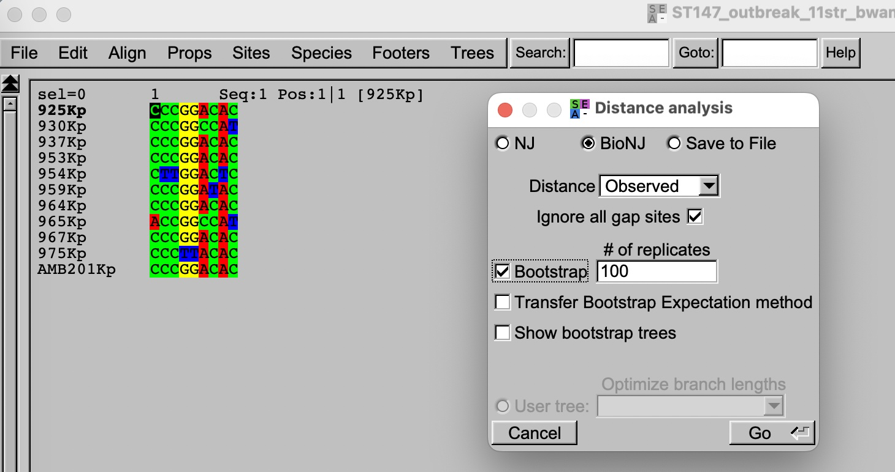
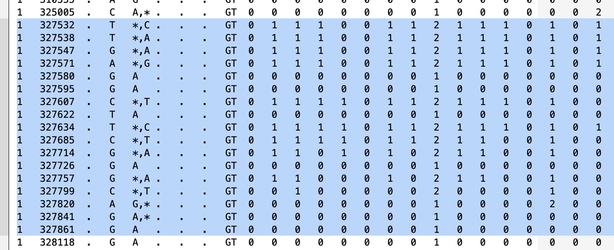
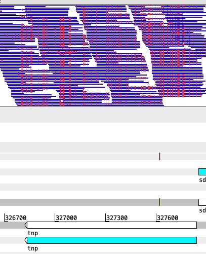
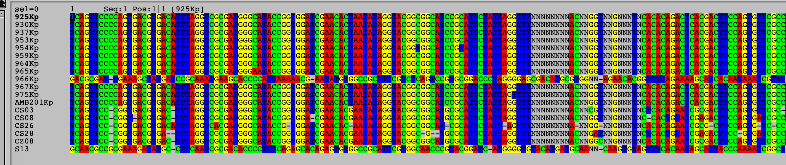
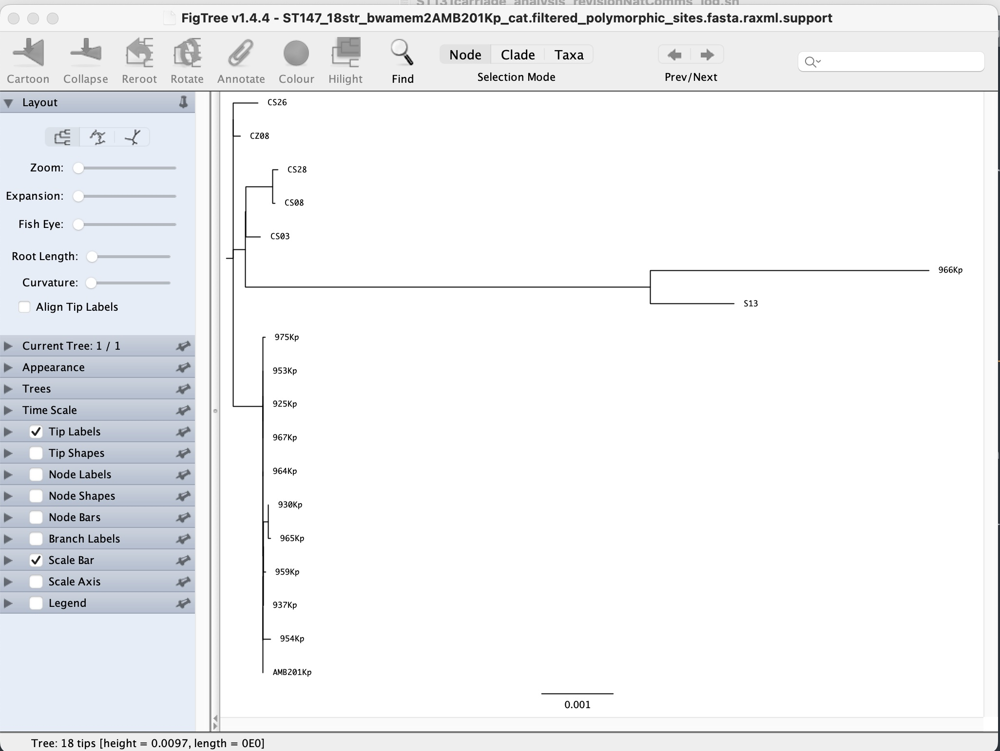
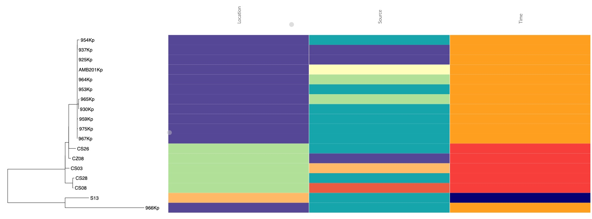

# Introduction

In contrast to mapping, the theory of phylogenetics is more nuanced and complex, but its practical steps are relatively straightforward. The practical steps herein will be used to build phylogenetic trees and understand their interpretations, using the Italian *Klebsiella pneumoniae* ST147 outbreak dataset.

# Data directory

# Phylogenetic tree construction

The first step in building a phylogenetic tree is to generate a multiple sequence alignment (MSA) \[*you can refer to this as an extension of the gene alignment problem*\]. Since we have already generated pseudogenome sequences for each of the samples in the morning, now we can use these to build an MSA file. Note that since the pseudogenome is already at the same length and in synteny with the reference, we can directly concatenate the pseudogenome fasta files without performing sequence alignment. This is a unique advantage of using pseudogenome sequences for phylogenetic analysis, as it allows us to bypass the computationally intensive step of sequence alignment and directly generate an MSA file that can be used for tree construction.

## 1. Concatenating pseudogenome fasta files

```{.bash}
# concatenating fasta files into a multifasta file
cat *_consensus.fasta > ST147_12str_bwamem2AMB201Kp_cat.mfasta 
grep '>' ST147_12str_bwamem2AMB201Kp_cat.mfasta 
```

## 2. Observe SNP distance matrix

We can roughly look at the SNP distance matrix and identify the genetic relatedness between the samples.

```{.bash}
# creating a SNP distance matrix using snp-dists
snp-dists ST147_12str_bwamem2AMB201Kp_cat.mfasta > ST147_12str_bwamem2AMB201Kp_cat.snpdist
more ST147_12str_bwamem2AMB201Kp_cat.snpdist
```

At this point, you can see that 11/12 samples are very closely related (0-6 SNPs apart), while one sample (966Kp) is \>3000 SNPs apart from the rest.

What would this suggest to us in terms of outbreak investigation?

## 3. Visualising SNP alignment and simple tree

You can try visualising the SNP alignment of only the outbreak related strains on SEAVIEW.

***Exercise***: Use commands to create a new whole genome alignment of outbreak strains, named `ST147_outbreak_11str_bwamem2AMB201Kp_cat.mfasta`

Whole genome alignment is quite big to visualise (\>5 Mbp), and you are only interested in the variation sites. So let's shorten the alignment to SNP alignment only.

```{.bash}
snp-sites -o ST147_outbreak_11str_bwamem2AMB201Kp_cat.snp.mfasta ST147_outbreak_11str_bwamem2AMB201Kp_cat.mfasta
```

Open SEAVIEW and load the SNP alignment file. You can build a simple tree using the built-in function of SEAVIEW, selecting `Trees > Distance methods`.

{width="752"}

***Question***: Can you tell which strains were most closely related to each other, and which were most different? Does this help you to interpret the outbreak timeline better?

## 4. Combine local with regional data

There have been outbreaks/reports of *K. pneumoniae* ST147 in the country. It is of interest to inspect whether the outbreak strains from this hospital are similar to those ST147 reported previously. From the original paper, the authors have identified two other previous studies in North Italy (PRJNA787449) and Calabria region (PRJNA1193841). We have prepared an additional 6 genomes from these previous studies

```{.bash}
cat ST147_12str_bwamem2AMB201Kp_cat.mfasta ../regional_extra_data/ST147_6extra_bwamem2AMB201Kp_cat.mfasta > ST147_18str_bwamem2AMB201Kp_cat.mfasta

## calculating SNP distance matrix using snp-dists
snp-dists ST147_18str_bwamem2AMB201Kp_cat.mfasta > ST147_18str_bwamem2AMB201Kp_cat.snpdist 
more ST147_18str_bwamem2AMB201Kp_cat.snpdist
```

***Question***: After looking at the snp distance matrix of these 18 strains. What is your conclusion?

***Exercise at home***: You can run mapping and variant calling script on 6 ST147 samples from the other hospitals, and to generate pseudogenome sequences for phylogenetic analyses. The necessary `fastq` input are found in `day-3/phylogenetics/additional_mapping`

## 5. A brief look at variation patterns

```{..bash}
snp-sites -v -o ST147_18str_bwamem2AMB201Kp_cat.snp.vcf ST147_18str_bwamem2AMB201Kp_cat.mfasta
```

Open the vcf file in a text editor and look quickly through the position of SNPs. Do you see that some SNP positions are clustered quite close together (\< 20 - 50 bp apart)? And which gene is it on the chromosome?

{fig-align="left" width="582"}

{width="285"}

## 6. An attempt to remove recombination regions

Recombination is defined as the process by which a segment of DNA is replaced by a homologous segment from another closely related organism. Recombination can introduce a large number of SNPs in a short region (densely clustered SNPs) and can confound phylogenetics and create misleading interpretation. Besides actual recombination events, other horizontal gene transfer (HGT) processes can also introduce a large number of SNPs in a short region, and these also need to be removed. Such common regions with high SNP density are transposons, integrons, or clone-specific prophages and antigenic/capsular loci.

For accurate estimation of phylogenetic relationship, these high SNP density regions need to be removed. A common tool used for this is `Gubbins` (Genealogies Unbiased By recomBinations In Nucleotide Sequences), which identifies regions that have undergone recombination by looking for clusters of SNPs in the alignment, and then removes these regions from the alignment before constructing the phylogenetic tree.

```{.bash}
## running Gubbins with 10 threads and 5 iterations
conda activate microgen2026_gubbins
run_gubbins.py --threads 10 -i 5 -m 3 ST147_18str_bwamem2AMB201Kp_cat.mfasta
conda deactivate
```

There are multiple outputs generated after running Gubbins, including: 

- `ST147_18str_bwamem2AMB201Kp_cat.filtered_polymorphic_sites.fasta`: the filtered alignment file with recombination regions removed, which can be used for tree construction. 
- `ST147_18str_bwamem2AMB201Kp_cat.recombination_predictions.gff`: the gff file with the predicted recombination regions, which can be used to visualise the recombination regions on the chromosome on ARTEMIS.
- `ST147_18str_bwamem2AMB201Kp_cat.summary_of_snp_distribution.vcf`: the vcf file with the SNPs in the filtered alignment, which can be used to visualise the SNP positions after Gubbins.

```{.bash}
# Let's reinspect the snp distance from these 18 strains after removing recombination
conda activate microgen2026_mapping
snp-dists ST147_18str_bwamem2AMB201Kp_cat.filtered_polymorphic_sites.fasta > ST147_18str_bwamem2AMB201Kp_cat_gubbins.snpdist
more ST147_18str_bwamem2AMB201Kp_cat_gubbins.snpdist
```

What is the difference that you see. Does running Gubbins change your overall interpretation?

***Exercise***: Load the `recombination_predictions.gff` file in ARTEMIS and visualise the predicted recombination regions on the chromosome. What regions are predicted as recombination regions? Do they correspond to the regions with high SNP density that you observed before?

## 7. Phylogenetic tree construction

We will proceed to use the `filtered_polymorphic_sites.fasta` file as input for phylogengetic tree construction. This is already an SNP alignment. You can start visualising it in SEAVIEW.



From this alignment, we can see that 16/18 strains were more closely related to each other, while 2 strains (966Kp and S13) were much different. While we can use built-in `Trees` function in SEAVIEW to build phylogenies, it does not support more complex tree building methods such as maximum likelihood (ML).

To build an ML tree, we resort to use RAxML, a widely used tool.

```{.bash}
conda activate microgen2026
# building an ML tree with 100 bootstraps
raxml-ng --all --msa ST147_18str_bwamem2AMB201Kp_cat.filtered_polymorphic_sites.fasta --model GTR+G+ASC_LEWIS --bs-trees 100 --threads 6
```

In this command, we applied a general DNA substitution model (`GTR+G`), which is commonly used for bacterial genomic phylogenetics. `ASC_LEWIS` is a correction for ascertainment bias, used when building trees from SNP alignments, as it accounts for the fact nonvariable sites are excluded and not sampled. The `--all` option tells RAxML to perform all steps of tree inference, including tree search, and bootstrapping.

The output from RAxML includes many files, including 

- `.raxml.support`: Tree in newick format with brach length information and bootstrap support **Main output** 
- `.raxml.bestTree`: Tree in newick format with branch length information but without bootstrap support 
- `.raxml.bootstraps`: 100 bootstrap trees in newick format 
- `.raxml.log`: log file with the details of the tree building process

## 8. Visualising ML tree

You can visualise the ML tree output using `FigTree`. Select `File > Open` and load the `.raxml.support` file.

{width="647"}

Since our main interest is to investigate the genetic relatedness between genomes, having a good outgroup is not as important in this scenario. We will proceed to root the tree using the two most distant strains (966Kp and S13). To do this, highlight the internal branch connecting `966Kp` and `S13`, and click and `Reroot` button.

A few steps to make your tree more interpretatable:

- In the `Trees` panel, check the `Order nodes` and order by `increasing`. This creates a ladderised tree.

- Check the `Node Labels` and select Display by `label` or `bootstrap`. This will show the bootstrap support for the node.

- Check the `Branch Labels` and select Display by `Branch lengths (raw)`. This will show the branch length on the tree, which is proportional to the number of SNPs between the nodes. Under the ASC_LEWIS correction model, inferring the number of SNPs from branch length is not possible. You can resort to calculate pairwise SNP directly from SNP distance.

***Question***: What can you conclude from the tree? Which strains are closely related to the outbreak strain?

## 9. Appending metadata to your phylogeny

Phylogenetic trees alone do not offer sufficient information for epidemiological understanding. It is common to combine phylogenetic tree with metadata. In this exercise, we will create a simple visualisation of such tree-metadata combination using a web-based tool called `phandango`.

First, save your tree from `Figtree` in newick format, select `File > Export Trees`. Select `Newick` format and `save as currently displayed`. Name the file `ST147_18str_bwamem2AMB201Kp_cat_gubbins_raxml.support.newick`.

Open browser and go to `https://jameshadfield.github.io/phandango/#/`. First drag and drop your newick tree file, then drag and drop and prepared metadata file `ST147_18str_metadata_short.csv` into the browser. You should see a window with this figure.


